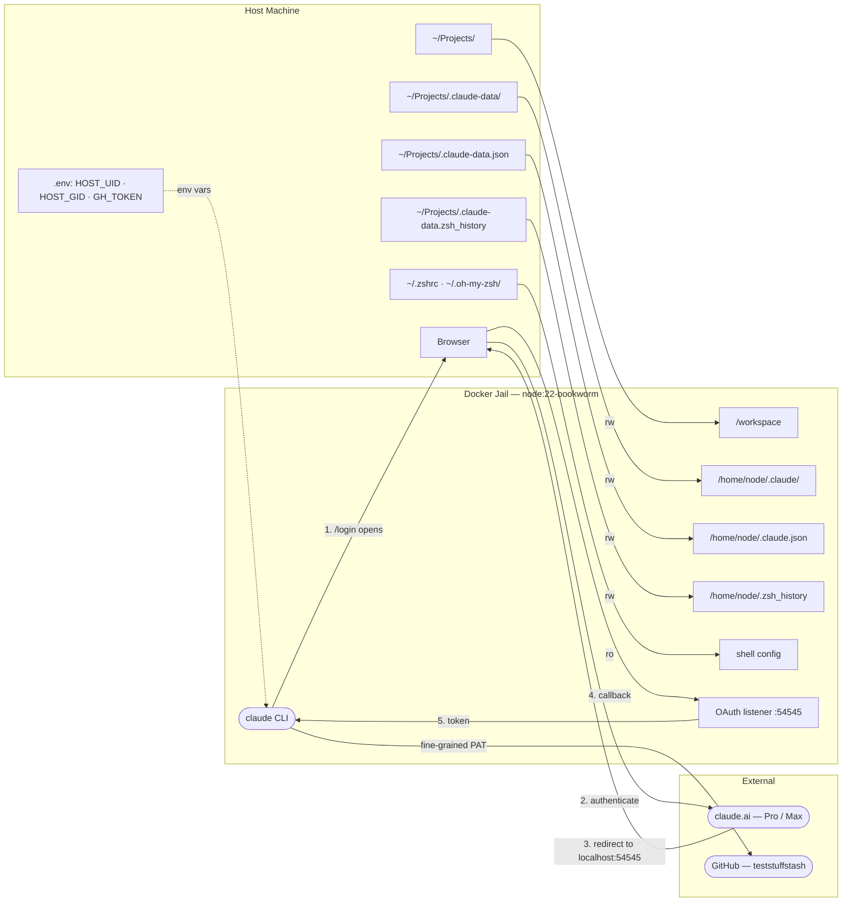

# Claude Code — Docker Jail

Runs Claude Code in an isolated Docker container with full permissions, persistent memory, and host file access. Files written inside the container are owned by your host user.

## Architecture



Claude runs as a non-root user with your host UID/GID — files created in `/workspace` appear on the host owned by you, no `chown` needed.

## Bootstrap

### 1. Build

```bash
./setup-env.sh
docker compose build
```

`setup-env.sh` writes your UID/GID to `.env` and generates `docker-compose.override.yml` with whichever zsh dotfiles exist on your host. Re-run it if your dotfiles change.

### 2. Run

```bash
docker compose run --rm claude
```

### 3. Log in

Inside Claude Code, run:

```
/login
```

This authenticates via your claude.ai account (Pro or Max). The session is persisted in `~/Projects/.claude-data/`.

### 4. GitHub CLI (optional)

GitHub doesn't support pre-selecting fine-grained token permissions via URL, so you'll need to configure these manually.

**First, enable fine-grained PATs in your org:**
`https://github.com/organizations/teststuffstash/settings/personal-access-tokens`
→ Allow access via fine-grained personal access tokens

**Then create the token:**
[Open token creation →](https://github.com/settings/personal-access-tokens/new?description=claude-jail&resource_owner=teststuffstash)

Configure it as follows:

| Field | Value |
|---|---|
| Resource owner | `teststuffstash` |
| Repository access | All repositories |
| Administration | Read and Write |
| Contents | Read and Write |
| Issues | Read and Write |
| Metadata | Read (auto) |
| Pull requests | Read and Write |
| Workflows | Read and Write |
| Everything else | No access |

Then add it to `.env`:

```bash
GH_TOKEN=github_pat_...
```

Repo deletions are recoverable — org owners can restore deleted repos via GitHub settings for 90 days.

## What's inside

| Path (container) | Path (host) | Notes |
|---|---|---|
| `/workspace` | `~/Projects` | Read-write. Your working directory. |
| `/home/node/.claude/` | `~/Projects/.claude-data/` | Memory, history, settings. |
| `/home/node/.claude.json` | `~/Projects/.claude-data.json` | Onboarding state (theme, startup count). |
| `/home/node/.zsh_history` | `~/Projects/.claude-data.zsh_history` | Shell history. |
| `/home/node/.zshrc` | `~/.zshrc` | Read-only. |
| `/home/node/.oh-my-zsh/` | `~/.oh-my-zsh/` | Read-write (plugin installs persist). |

## Re-running

```bash
docker compose run --rm claude
```

No rebuild needed unless you update the `Dockerfile`. Re-run `setup-env.sh` if your zsh dotfiles change.
